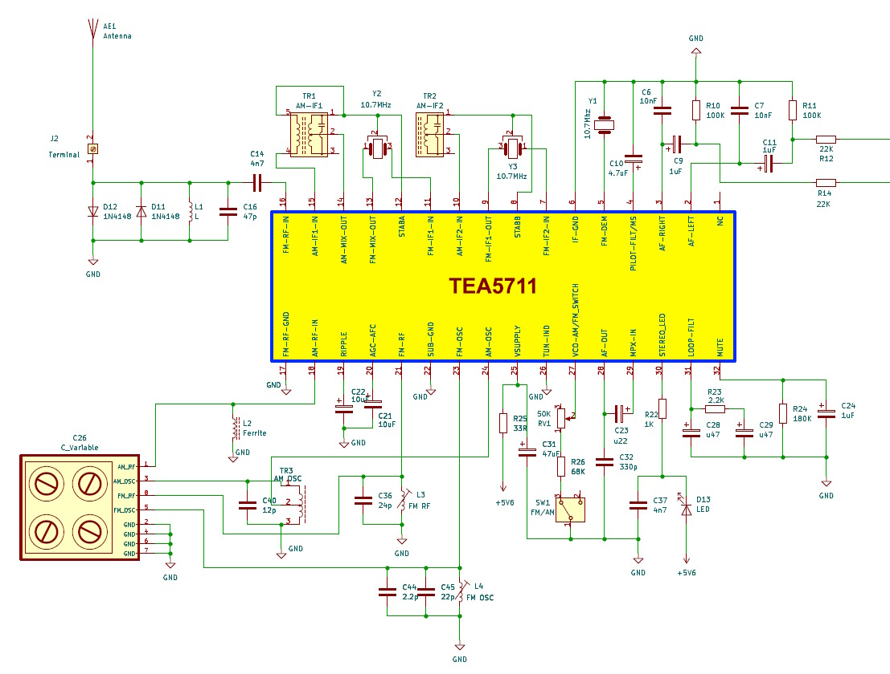
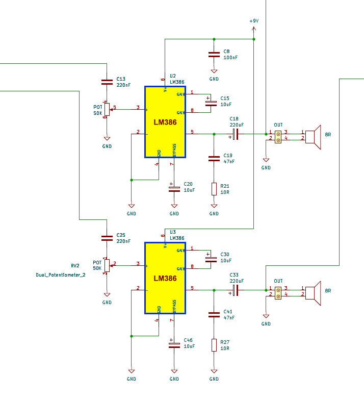
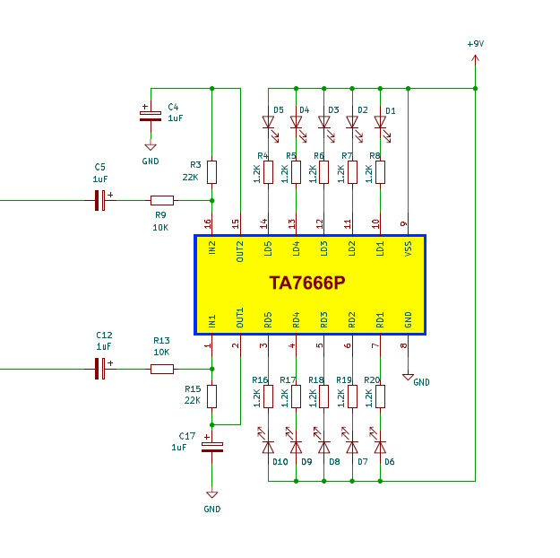
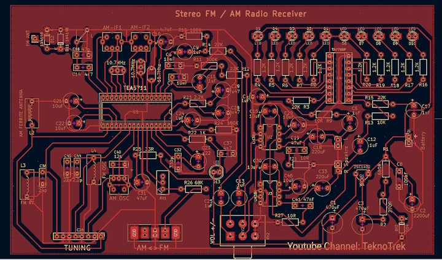
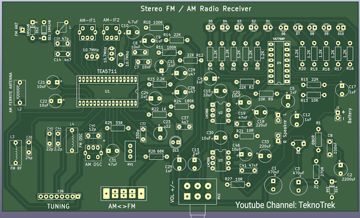
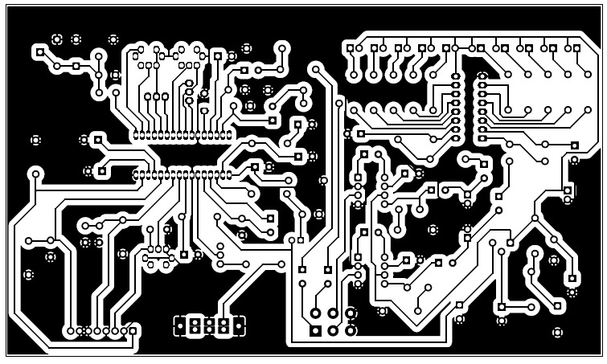
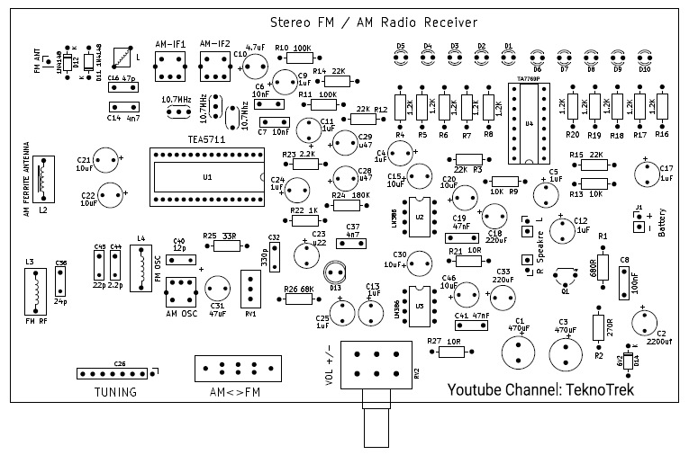

# Stereo FM / AM Radio Receiver With VU Meter (TEA5711 + LM386)

A fully analog **Stereo FM / AM Radio Receiver** project based on the **TEA5711** radio IC, featuring **dual LM386 audio amplifiers** and a **10-LED stereo VU meter**.  
This project has been **personally tested and successfully assembled** on a working prototype.

📺 **Build Video:**  
https://youtu.be/hSCuRKkPxRc  

📌 **YouTube Channel:**  
https://www.youtube.com/@TeknoTrek

---

## 📌 Project Overview

This project demonstrates how to build a **high-quality FM stereo and AM radio receiver** using classic through-hole components.  
It is suitable for hobbyists, students, and electronics enthusiasts interested in **RF reception, analog audio amplification, and signal visualization**.

### Key Features
- FM Stereo & AM reception using **TEA5711**
- Dual-channel audio amplification (**2 × LM386**)
- Real-time audio level display (**Stereo VU Meter – TA7666P / KIA7666P**)
- Low-noise regulated power supply
- DIY-friendly single-layer PCB

---

## 🧩 Functional Blocks

### 1. Radio Receiver Section (TEA5711)

The main RF section processes both **FM and AM signals**.

**Highlights**
- FM stereo and AM receiver in a single IC
- High sensitivity even at low supply voltages
- Manual tuning via variable capacitor
- Ceramic IF filters for FM selectivity (10.7 MHz)

**Technical Details**
- FM antenna: Telescopic antenna (AE1)
- AM antenna: Ferrite rod antenna (L2)
- FM IF filters: Y2, Y3 (10.7 MHz)
- Antenna protection: 1N4148 diodes (D11, D12)

---

### 2. Audio Amplifier Section (2 × LM386)

Amplifies low-level stereo audio signals to speaker level.

**Features**
- Independent left and right channel amplification
- Dual-gang potentiometer for volume control
- Zobel networks at outputs to prevent oscillation

**Notes**
- Adding a 10 µF capacitor between pins 1–8 sets LM386 to maximum gain
- Designed for **8 Ω speakers**

---

### 3. Stereo VU Meter Section (TA7666P)

Provides visual feedback of audio signal levels.

**Features**
- 10 LEDs total (5 per channel)
- True stereo level indication
- Adjustable response speed via RC networks

**Protection**
- 1.2 kΩ current-limiting resistor per LED

---

### 4. Power Supply & Regulation

Ensures stable operation of RF and audio stages.

**Specifications**
- Input: 9 V DC (battery or external supply)
- Regulated output: ~5.6 V for radio section
- Regulation: Transistor + Zener diode
- Large filtering capacitors for low noise and ripple

---

## 🖥️ PCB Design

- Single-layer PCB
- Wide ground traces to minimize interference
- Clearly labeled silkscreen
- Optimized placement for AM IF transformers and ferrite antenna

### User Controls
- **Tuning**
- **AM / FM mode switch**
- **Volume (dual potentiometer)**

---

## 🧲 PCB Production (DIY Friendly)

Mirror-image PCB layouts are provided for:
- Toner transfer
- Iron-on PCB fabrication

⚠️ **Important:**  
Print at **1:1 scale** to ensure correct IC pin alignment.

---

## 💬 Questions or Feedback?
Feel free to open an issue or leave a comment on the [YouTube video](https://youtu.be/TuUUNz7IGRk). I’d love to hear your thoughts and help if you get stuck!

## 📡 Tags & Keywords (for SEO)
`AM radio receiver`, `FM radio project`, `Sony CXA1019S`, `build a radio`, `DIY electronics`, `PCB design`, `KiCad project`, `radio circuit`, `home radio`, `electronics tutorial`, `radio IC`, `radio PCB`, `TeknoTrek`, `radio receiver project`, `electronics for beginners`

## ❓ FAQ  
**Q: Can I modify the PCB for better performance?**  
A: Yes! The KiCad files are fully editable. Optimize traces or add filters as needed.  

**Q: Where can I buy the CXA1019S IC?**  
A: Check AliExpress, eBay, or local electronics stores.  

## 🌟 Support the Project  
- **Give a ⭐ on GitHub** if you find this useful!  
- **Subscribe to [TeknoTrek on YouTube](https://www.youtube.com/@TeknoTrek)** for more DIY electronics projects.  
- **Share your build** in the Discussions section!  

📢 **Disclaimer**: This is an open-source project. Use at your own risk.  

#electronics #diy #radio #cxA1019s #pcbdesign #kicad #amfmradio #engineering #teknopatik  

